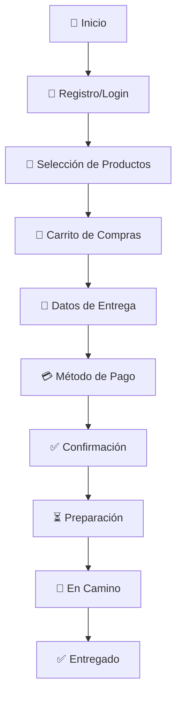
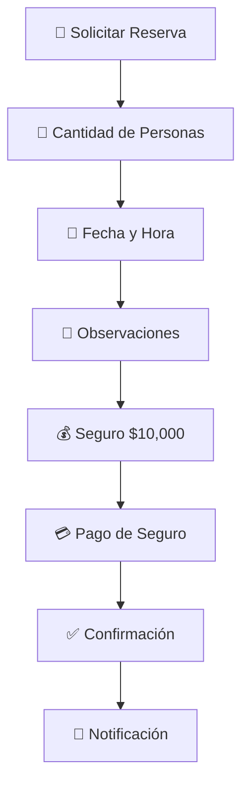

# 🤖 TelegramFoodBot - Sistema Integral de Pedidos por Telegram

[](https://dotnet.microsoft.com/download)
[](https://core.telegram.org/bots/api)
[](https://docs.microsoft.com/en-us/dotnet/desktop/winforms/)
[](https://www.microsoft.com/en-us/sql-server)

## 📋 Descripción

**TelegramFoodBot** es un sistema completo de gestión de pedidos de comida que opera a través de Telegram. Permite a los clientes realizar pedidos y reservas de manera interactiva, mientras que los administradores pueden gestionar todo el proceso desde una interfaz de escritorio intuitiva.

### 🌟 Características Principales

- 🍕 **Gestión Completa de Pedidos**: Desde la selección de productos hasta la entrega
- 📅 **Sistema de Reservas**: Con manejo de seguros y confirmaciones
- 💳 **Múltiples Métodos de Pago**: Efectivo, transferencias, y confirmaciones digitales
- 👨‍💼 **Panel de Administración**: Interfaz Windows Forms para gestión completa
- 🤖 **Bot Inteligente**: Respuestas automáticas y navegación intuitiva
- 📊 **Reportes y Estadísticas**: Historial completo de pedidos y reservas
- 🔄 **Estados en Tiempo Real**: Seguimiento de pedidos paso a paso

## 🏗️ Arquitectura del Sistema

El proyecto sigue una arquitectura en capas (N-Layer Architecture) bien estructurada:

```
TelegramFoodBot/
├── 🎯 TelegramFoodBot.Presentation/    # Capa de Presentación (Windows Forms)
├── 🔧 TelegramFoodBot.Business/        # Capa de Lógica de Negocio
├── 💾 TelegramFoodBot.Data/           # Capa de Acceso a Datos
├── 📦 TelegramFoodBot.Entities/       # Entidades y Modelos
└── 🗃️ DataBase/                      # Scripts de Base de Datos
```

### 📁 Estructura Detallada

#### 🎯 TelegramFoodBot.Presentation (Interfaz de Administrador)
```
Forms/
├── 🔐 Login.cs                       # Autenticación de administradores
├── 🏠 FormInicio.cs                  # Dashboard principal
├── 🍽️ FormPedidos.cs                 # Gestión de pedidos activos
├── 📅 FormReservas.cs                # Gestión de reservas
├── 💬 FormChats.cs                   # Monitor de conversaciones
├── 🍕 FormConfiMenu.cs               # Configuración de menú y productos
├── 💳 FormConfiPagos.cs              # Configuración de métodos de pago
└── 📊 FormHistorial.cs               # Historial y reportes
```

#### 🔧 TelegramFoodBot.Business (Lógica de Negocio)
```
Commands/
├── 📝 ComandoRegistro.cs             # Registro de nuevos usuarios
├── 🛒 ComandoPedido.cs               # Procesamiento de pedidos
└── 📅 ComandoReserva.cs              # Gestión de reservas

Services/
├── 🤖 TelegramService.cs             # Servicio principal del bot
├── 🚀 EnhancedTelegramService.cs     # Servicio mejorado con diagnósticos
├── 🔄 CallbackHandlerService.cs      # Manejo de callbacks de botones
├── 💬 ChatService.cs                 # Gestión de conversaciones
├── 🍕 ProductoService.cs             # CRUD de productos
└── 📂 CategoriaService.cs            # CRUD de categorías

Interfaces/
├── 🤖 ITelegramService.cs            # Contrato del servicio Telegram
├── 💬 IChatService.cs                # Contrato del servicio de chat
└── 🔄 ICallbackHandler.cs            # Contrato para handlers de callbacks
```

#### 💾 TelegramFoodBot.Data (Acceso a Datos)
```
├── 🔗 DatabaseConnection.cs          # Conexión a base de datos
├── 👤 ClienteRepository.cs           # CRUD de clientes
├── 🛒 PedidoRepository.cs            # CRUD de pedidos
├── 📅 ReservaRepository.cs           # CRUD de reservas
├── 🍕 ProductoRepository.cs          # CRUD de productos
├── 📂 CategoriaRepository.cs         # CRUD de categorías
├── 💳 CuentaPagoRepository.cs        # CRUD de cuentas de pago
├── 💬 MessageRepository.cs           # CRUD de mensajes
└── 👨‍💼 AdminRepository.cs             # CRUD de administradores
```

#### 📦 TelegramFoodBot.Entities (Modelos de Datos)
```
Models/
├── 👤 User.cs                        # Modelo de usuario de Telegram
├── 🧑‍🤝‍🧑 Client.cs                      # Modelo de cliente registrado
├── 🛒 Pedido.cs                      # Modelo de pedido
├── 📅 Reserva.cs                     # Modelo de reserva
├── 🍕 Producto.cs                    # Modelo de producto
├── 📂 Categoria.cs                   # Modelo de categoría
├── 💳 CuentaPago.cs                  # Modelo de cuenta de pago
├── 💬 Message.cs                     # Modelo de mensaje
├── 🔄 PedidoEnProceso.cs             # Estado temporal de pedido
└── 📊 *EventArgs.cs                  # Argumentos de eventos
```

## 🗄️ Base de Datos

### 📊 Esquema de la Base de Datos: `TelegramPedidosDB`

```sql
Tables:
├── 👨‍💼 Administradores              # Usuarios administradores
├── 🧑‍🤝‍🧑 Clientes                     # Clientes registrados
├── 📂 Categorias                   # Categorías de productos
├── 🍕 Productos                    # Catálogo de productos
├── 🛒 Pedidos                      # Pedidos realizados
├── 📋 DetallePedido                # Detalles de productos por pedido
├── 📅 Reservas                     # Reservas de mesa
├── 💳 CuentasPago                  # Métodos de pago registrados
└── 💬 Mensajes                     # Historial de conversaciones
```

### 🔐 Credenciales de Acceso

| Tipo | Usuario | Contraseña | Descripción |
|------|---------|------------|-------------|
| 👨‍💼 **Admin** | `admin` | `1234` | Acceso completo al sistema |
| 🗃️ **Database** | - | - | `TelegramPedidosDB` |

## 🚀 Instalación y Configuración

### 📋 Prerrequisitos

- ✅ **.NET Framework 4.7.2** o superior
- ✅ **SQL Server** (LocalDB, Express, o completo)
- ✅ **Visual Studio 2022** (recomendado)
- ✅ **Bot de Telegram** (token configurado)

### 📥 Instalación

1. **Clonar el repositorio**:
   ```bash
   git clone [repository-url]
   cd TelegramFoodBot
   ```

2. **Configurar la base de datos**:
   ```sql
   -- Ejecutar el script en SQL Server Management Studio
   -- Archivo: DataBase/DataBase.sql
   ```

3. **Restaurar dependencias**:
   ```bash
   dotnet restore
   ```

4. **Configurar el bot de Telegram**:
   - Token actual configurado: `8153338706:AAGbRIiiTkfflyqiCjSGoIN3e-aaIOfvBbI`
   - Ubicación: `TelegramFoodBot.Business/Configuration/BotConfiguration.cs`

5. **Compilar y ejecutar**:
   ```bash
   dotnet build
   dotnet run --project TelegramFoodBot.Presentation
   ```

### ⚙️ Configuración de la Cadena de Conexión

Ubicación: `TelegramFoodBot.Data/DatabaseConnection.cs`

```csharp
// Configuración por defecto (LocalDB)
private static string connectionString = @"Server=(localdb)\MSSQLLocalDB;Database=TelegramPedidosDB;Integrated Security=true;";

// Para SQL Server Express
// private static string connectionString = @"Server=.\SQLEXPRESS;Database=TelegramPedidosDB;Integrated Security=true;";

// Para SQL Server con autenticación
// private static string connectionString = @"Server=servidor;Database=TelegramPedidosDB;User Id=usuario;Password=contraseña;";
```

## 🤖 Funcionalidades del Bot

### 🎯 Comandos Principales

| Comando | Descripción | Emoji |
|---------|-------------|--------|
| `/start` | Iniciar conversación con el bot | 🚀 |
| `/pedir` | Iniciar proceso de pedido | 🛒 |
| `/reservar` | Realizar reserva de mesa | 📅 |

### 🛒 Flujo de Pedidos



### 📅 Flujo de Reservas



### 🎮 Botones Interactivos

#### 🍕 Navegación de Menú
- **🏠 Inicio**: Volver al menú principal
- **🍕 Productos**: Navegar por categorías
- **🛒 Carrito**: Ver productos seleccionados
- **📋 Mi Pedido**: Estado actual del pedido
- **📞 Contacto**: Hablar con un asesor

#### 💳 Métodos de Pago
- **💵 Efectivo**: Pago contra entrega
- **🏧 Transferencia**: Pago por transferencia bancaria
- **💳 Tarjeta**: Pago con tarjeta (próximamente)

#### 📊 Estados de Pedido
- **⏳ Pendiente**: Esperando confirmación
- **✅ Aceptado**: Pedido confirmado
- **👨‍🍳 Preparación**: En cocina
- **🚚 En Camino**: Siendo entregado
- **✅ Terminado**: Entregado exitosamente

## 💻 Panel de Administración

### 🔐 Login de Administrador

```
Usuario: admin
Contraseña: 1234
```

### 🏠 Dashboard Principal (FormInicio)

- 📊 **Estadísticas en Tiempo Real**
- 🔥 **Pedidos Activos**
- 📈 **Métricas del Día**
- ⚡ **Accesos Rápidos**

### 🛒 Gestión de Pedidos (FormPedidos)

#### 🎯 Funcionalidades
- ✅ **Ver Pedidos Activos** con priorización por estado
- 🔄 **Cambiar Estados**: Preparación → En Camino → Terminado
- 💳 **Confirmar Pagos** recibidos
- 📞 **Contactar Clientes** directamente
- 📋 **Ver Detalles Completos** de cada pedido

#### 🚦 Estados y Colores
```csharp
// Código de colores para estados
PENDIENTE     → 🟡 Amarillo (Prioridad Máxima)
ACEPTADO      → 🟢 Verde
PREPARACIÓN   → 🟠 Naranja  
EN CAMINO     → 🔵 Azul
TERMINADO     → ⚪ Gris
PAGO PENDIENTE → 🔴 Rojo (Requiere Atención)
```

### 📅 Gestión de Reservas (FormReservas)

- 📋 **Lista de Reservas** ordenadas por fecha
- ✅ **Confirmar/Cancelar** reservas
- 💰 **Gestionar Seguros** ($10,000 COP)
- 📞 **Contactar Clientes** para confirmaciones

### 🍕 Configuración de Menú (FormConfiMenu)

#### 📂 Gestión de Categorías
- ➕ **Crear** nuevas categorías
- ✏️ **Editar** categorías existentes
- 🔄 **Activar/Desactivar** categorías
- 🗑️ **Eliminar** categorías (si no tienen productos)

#### 🍕 Gestión de Productos
- ➕ **Agregar** nuevos productos
- ✏️ **Editar** información de productos
- 💰 **Configurar** precios
- 🎯 **Gestionar** promociones
- 🔄 **Activar/Desactivar** productos
- 📂 **Asignar** a categorías

### 💳 Configuración de Pagos (FormConfiPagos)

- 💳 **Gestionar Cuentas** bancarias
- 📱 **Configurar** métodos digitales
- ✏️ **Editar** información de pago
- 🔄 **Activar/Desactivar** métodos

### 💬 Monitor de Chats (FormChats)

- 👁️ **Monitorear** conversaciones en tiempo real
- 📞 **Intervenir** en chats cuando sea necesario
- 📊 **Ver Historial** de conversaciones
- 🚨 **Alertas** de problemas o consultas especiales

### 📊 Historial y Reportes (FormHistorial)

- 📈 **Reportes** de ventas por período
- 📊 **Estadísticas** de productos más vendidos
- 💰 **Análisis** de ingresos
- 📅 **Filtros** por fecha, cliente, producto
- 📋 **Exportar** datos a Excel/PDF (próximamente)

## 🔧 Tecnologías Utilizadas

### 🖥️ Frontend (Windows Forms)
- **.NET Framework 4.7.2 Windows Forms** - Interfaz de usuario
- **System.Windows.Forms** - Controles nativos de Windows
- **Custom Controls** - Componentes personalizados

### 🔧 Backend (Business Logic)
- **.NET Framework 4.7.2** - Framework principal
- **Telegram.Bot 18.0.0** - API oficial de Telegram
- **Telegram.Bot.Extensions.Polling 1.0.2** - Polling automático
- **System.Threading.Tasks** - Programación asíncrona

### 💾 Base de Datos
- **SQL Server** - Base de datos relacional
- **ADO.NET** - Acceso a datos
- **System.Data.SqlClient** - Proveedor de SQL Server

### 🏗️ Arquitectura
- **N-Layer Architecture** - Separación en capas
- **Repository Pattern** - Patrón de repositorio
- **Dependency Injection** - Inyección de dependencias
- **Event-Driven** - Arquitectura basada en eventos
- **Singleton Pattern** - Para servicios globales

## 📚 Ejemplos de Uso

### 🤖 Interacción con el Bot

#### 📝 Registro de Cliente
```
Bot: 👋 ¡Hola! Soy el bot de [Nombre del Restaurante]
     Para comenzar, necesito registrarte.
     📱 ¿Cuál es tu número de teléfono?

Usuario: 3001234567

Bot: ✅ ¡Perfecto! Ya estás registrado.
     🍕 ¿Qué te gustaría hacer?
     [🛒 Hacer Pedido] [📅 Reservar Mesa] [📋 Mi Cuenta]
```

#### 🛒 Realizar Pedido
```
Usuario: 🛒 Hacer Pedido

Bot: 🍕 ¡Excelente! Aquí está nuestro menú:
     
     🍕 PIZZAS
     🍔 HAMBURGUESAS  
     🥤 BEBIDAS
     🍰 POSTRES
     
     Selecciona una categoría:

Usuario: [🍕 PIZZAS]

Bot: 🍕 PIZZAS DISPONIBLES:
     
     1. 🍕 Pizza Margherita - $25,000
        [➕ Agregar al Carrito]
     
     2. 🍕 Pizza Pepperoni - $28,000
        [➕ Agregar al Carrito]
     
     3. 🍕 Pizza Hawaiana - $30,000
        [➕ Agregar al Carrito]
```

#### 📅 Hacer Reserva
```
Usuario: 📅 Reservar Mesa

Bot: 📅 ¡Perfecto! Vamos a reservar tu mesa.
     👥 ¿Para cuántas personas?
     
     [1] [2] [3] [4] [5] [Más]

Usuario: [4]

Bot: 📅 ¿Para qué fecha?
     
     [📅 Hoy] [📅 Mañana] [📝 Otra fecha]

Usuario: [📅 Mañana]

Bot: 🕐 ¿A qué hora?
     
     [🕕 6:00 PM] [🕖 7:00 PM] [🕗 8:00 PM] [🕘 9:00 PM]

Usuario: [🕖 7:00 PM]

Bot: 💰 Para confirmar tu reserva necesitamos un seguro de $10,000
     que se descuenta de tu cuenta al momento de la visita.
     
     💳 ¿Cómo deseas pagar el seguro?
     [💵 Efectivo] [🏧 Transferencia]
```

### 💻 Gestión desde el Panel de Admin

#### 🛒 Procesando un Pedido
```
1. 🔔 Llega notificación: "Nuevo pedido #PED001"
2. 👨‍💼 Admin abre FormPedidos
3. 👀 Ve pedido en estado "PENDIENTE" (amarillo)
4. 📋 Hace clic para ver detalles:
   
   Cliente: Juan Pérez
   Teléfono: 3001234567
   Dirección: Calle 123 #45-67
   Productos:
   - 1x Pizza Margherita ($25,000)
   - 2x Coca Cola ($5,000)
   Total: $30,000
   Pago: Efectivo
   
5. ✅ Acepta el pedido → Estado cambia a "ACEPTADO"
6. 👨‍🍳 Cuando está listo → "PREPARACIÓN"
7. 🚚 Sale para entrega → "EN CAMINO"
8. ✅ Confirma entrega → "TERMINADO"
```

#### 🍕 Agregando un Producto
```
1. 👨‍💼 Admin abre FormConfiMenu
2. 📂 Selecciona categoría "PIZZAS"
3. ➕ Hace clic en "Agregar Producto"
4. 📝 Completa formulario:
   
   Nombre: Pizza BBQ
   Descripción: Pizza con salsa BBQ, pollo, cebolla y queso
   Precio: $32,000
   Categoría: PIZZAS
   Estado: ACTIVO
   Promoción: INACTIVO
   
5. 💾 Guarda → Producto disponible inmediatamente en el bot
```

## 📊 Eventos y Notificaciones

### 🔔 Eventos del Sistema

#### 📱 En el Bot (Cliente)
```csharp
// Eventos de pedido
PedidoCreado?.Invoke(this, new PedidoEventArgs(pedido));

// Eventos de reserva  
ReservaCreada?.Invoke(this, new ReservaEventArgs(reserva));

// Eventos de mensaje
MessageReceived?.Invoke(this, new MessageEventArgs(message));
```

#### 💻 En el Panel Admin
```csharp
// Notificaciones en tiempo real
public event EventHandler<PedidoEventArgs> NuevoPedido;
public event EventHandler<ReservaEventArgs> NuevaReserva;
public event EventHandler<MessageEventArgs> NuevoMensaje;

// Actualización automática de interface
private void OnNuevoPedido(object sender, PedidoEventArgs e)
{
    // Actualizar lista de pedidos
    CargarPedidosActivos();
    
    // Mostrar notificación
    MostrarNotificacion($"Nuevo pedido: {e.Pedido.Id}");
    
    // Reproducir sonido de alerta
    SystemSounds.Asterisk.Play();
}
```

## 🛡️ Seguridad y Configuración

### 🔐 Autenticación
- ✅ **Login seguro** para administradores
- 🔑 **Validación** de credenciales en base de datos
- ⏰ **Sesiones** con timeout automático

### 🛡️ Validaciones de Datos
```csharp
// Validación de teléfonos
public static bool ValidarTelefono(string telefono)
{
    return Regex.IsMatch(telefono, @"^[3][0-9]{9}$");
}

// Validación de precios
public static bool ValidarPrecio(decimal precio)
{
    return precio > 0 && precio <= 1000000;
}

// Sanitización de texto
public static string SanitizarTexto(string texto)
{
    return texto?.Trim().Replace("'", "''") ?? "";
}
```

### 🔄 Manejo de Errores
```csharp
// Logging de errores
try
{
    // Operación de base de datos
    await _repository.GuardarPedido(pedido);
}
catch (SqlException ex)
{
    Console.WriteLine($"Error de BD: {ex.Message}");
    await NotificarError("Error al guardar pedido");
    throw;
}
catch (Exception ex)
{
    Console.WriteLine($"Error general: {ex.Message}");
    await NotificarError("Error inesperado");
    throw;
}
```

## 📈 Optimizaciones y Rendimiento

### ⚡ Configuraciones de Performance

#### 🤖 Bot de Telegram
```csharp
// Timeouts optimizados
private static readonly TimeSpan DEFAULT_TIMEOUT = TimeSpan.FromSeconds(30);
private static readonly TimeSpan CALLBACK_TIMEOUT = TimeSpan.FromSeconds(10);

// HttpClient configurado
var httpClient = new HttpClient(handler)
{
    Timeout = DEFAULT_TIMEOUT
};

// Deshabilitación de proxy para mejor rendimiento
var handler = new HttpClientHandler()
{
    UseProxy = false,
    UseCookies = false,
    UseDefaultCredentials = false
};
```

#### 💾 Base de Datos
```sql
-- Índices para optimización
CREATE INDEX IX_Pedidos_Estado ON Pedidos(Estado);
CREATE INDEX IX_Pedidos_FechaHora ON Pedidos(FechaHora);
CREATE INDEX IX_Productos_CategoriaId ON Productos(CategoriaId);
CREATE INDEX IX_Clientes_TelegramId ON Clientes(Id);
```

### 🔄 Pooling y Caché
```csharp
// Caché de productos para evitar consultas repetitivas
private static Dictionary<int, List<Producto>> _cacheProductos = new();

// Pooling de conexiones automático con ADO.NET
private static string connectionString = 
    @"Server=(localdb)\MSSQLLocalDB;Database=TelegramPedidosDB;
      Integrated Security=true;Pooling=true;Max Pool Size=100;";
```

## 🔧 Mantenimiento y Soporte

### 📝 Logs del Sistema

#### 📍 Ubicaciones de Logs
```
Logs/
├── 🤖 telegram-bot.log          # Actividad del bot
├── 💻 admin-panel.log           # Actividad del panel
├── 💾 database.log              # Operaciones de BD
├── 🚨 errors.log                # Errores del sistema
└── 📊 performance.log           # Métricas de rendimiento
```

#### 📊 Monitoreo
```csharp
// Diagnósticos automáticos
Console.WriteLine("=== DIAGNÓSTICO DEL SISTEMA ===");
Console.WriteLine($"OS: {Environment.OSVersion}");
Console.WriteLine($"Machine: {Environment.MachineName}");
Console.WriteLine($"User: {Environment.UserName}");
Console.WriteLine($"CLR Version: {Environment.Version}");
Console.WriteLine($"Working Directory: {Environment.CurrentDirectory}");
Console.WriteLine("===============================");
```

### 🔧 Tareas de Mantenimiento

#### 📅 Diarias
- ✅ Verificar conectividad del bot
- 📊 Revisar logs de errores
- 💾 Backup automático de BD
- 📈 Revisar métricas de rendimiento

#### 📅 Semanales
- 🧹 Limpiar logs antiguos
- 📊 Generar reportes de actividad
- 🔄 Actualizar caché de productos
- 🛡️ Verificar seguridad

#### 📅 Mensuales
- 📈 Análisis de tendencias
- 🔄 Optimización de BD
- 📱 Actualizaciones del bot
- 📋 Revisión de configuraciones

## 🚨 Solución de Problemas

### ❌ Problemas Comunes

#### 🤖 Bot No Responde
```bash
# Verificar conectividad
ping api.telegram.org

# Revisar token
curl -X GET "https://api.telegram.org/bot[TOKEN]/getMe"

# Verificar logs
tail -f Logs/telegram-bot.log
```

#### 💾 Error de Base de Datos
```sql
-- Verificar conexión
SELECT @@VERSION;

-- Verificar tablas
SELECT name FROM sys.tables;

-- Verificar espacio
EXEC sp_spaceused;
```

#### 💻 Panel de Admin No Abre
```bash
# Verificar .NET
dotnet --version

# Recompilar
dotnet clean
dotnet build

# Ejecutar con logs
dotnet run --project TelegramFoodBot.Presentation --verbosity detailed
```

## 🤝 Contribuciones

### 👥 Equipo de Desarrollo
- Dev: Miguel Garcia
- Dev: Yorfran Sanjuan
- Dev: Jhon Gomez

### 📋 Cómo Contribuir
1. 🍴 Fork del repositorio
2. 🌟 Crear rama para nueva característica
3. 💾 Commit de cambios
4. 📤 Push a la rama
5. 🔄 Crear Pull Request

### 📝 Estándares de Código
- ✅ **C# Coding Standards** de Microsoft
- 📝 **Comentarios** en español
- 🧪 **Unit Tests** para lógica crítica
- 📚 **Documentación** actualizada

## 📄 Licencia

Este proyecto está licenciado bajo la Licencia MIT - ver el archivo [LICENSE.md](LICENSE.md) para más detalles.

## 🙏 Agradecimientos

- 🤖 **Telegram Bot API** - Por la excelente documentación
- 🏢 **Microsoft** - Por .NET Framework y herramientas
- 🌐 **Comunidad Open Source** - Por las librerías utilizadas
- 👥 **Testers Beta** - Por su invaluable feedback
- 👨‍🏫 **John Patiño** - Por su asesoramiento durante el proyecto

---

## 📞 Información de Contacto

- 📧 **Email**: [dazamiguel95@gmail.com] / [yorfranysg@gmail.com]
- 📱 **WhatsApp**: +57 3117312426 / +57 3022833789

---

<div align="center">

### ⭐ Si este proyecto te fue útil, ¡no olvides darle una estrella! ⭐

**TelegramFoodBot v3.0** - *Desarrollado con ❤️ para la industria gastronómica*

[🔝 Volver al inicio](#-telegramfoodbot---sistema-integral-de-pedidos-por-telegram)

</div>